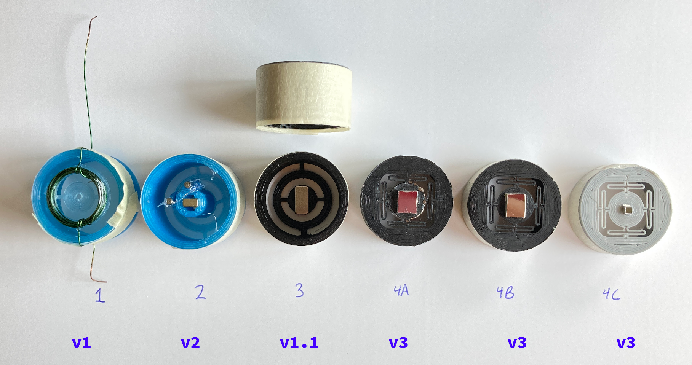

# MEMS Mirror STLs

## Progression

## Files
* `Mirror-Gimbal` - Original 2-axis galvanometer design
* `Mirror-Gimbal-v1.1` - Minor update
* `Mirror-Gimbal-v1.2` - Increased torsion arm length
* `Mirror-Gimbal-v2` - Original 2-axis with vertical magnet mounts
* `Mirror-Gimbal-V3` - Uses quad "O" supports (0.5mm width)
* `Mirror-Gimbal-V3-0.6mm` - Quad "O" supports (0.6mm width)
* `MDD-BoardMount` - Mount for holding deflection driver PCBs and magnetic deflection yoke.

## Printer Settings

### Mirror Gimbals
* Initial layer height should be set to `0.25mm`
* Bottom layer should be printed as `concentric`

### Everything Else
* Pretty much whatever works on your printer

## Assembling
The mirror gimbals should be printed with the above settings.
Use superglue to attach a small neodymium magnet to the back (inside) of the central disk on the gimbal. The smaller the magnet, the less mass of the overall system, and thus an increased resonant (and operating) frequency. The disadvantage to a smaller magnet is its weaker magnetic field, meaning that a larger external field must be applied to achieve the same deflection.
For the mirrors, I cut out squares from a dead HDD platter, which were then superglued onto the top of the gimbal's central disk. (For reference, the mirror for gimbal 4C is about 2mm square while 4A's mirror is about 7mm square.)
